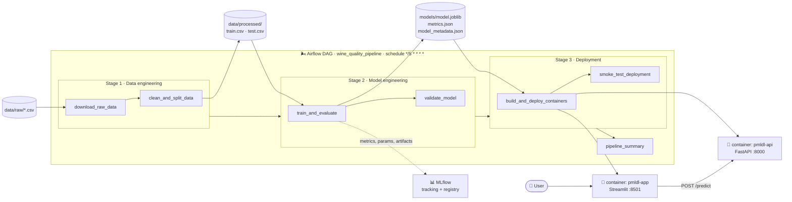

# 🍷 Wine Quality MLOps Pipeline — PMLDL Assignment 1 (Deployment)

[](https://github.com/LeoVesinML/pmldl-assignment1-deployment/actions/workflows/ci.yml)

An end-to-end, **fully automated MLOps pipeline** that runs **every 5 minutes** and covers the
three required stages: **data engineering → model engineering → deployment**.
The trained model is served by a **FastAPI** container and consumed by a **Streamlit** web
application running in a **separate container**; the whole thing is orchestrated by
**Apache Airflow** and tracked in **MLflow**.

| Service | URL (defaults) | Description |
| --- | --- | --- |
| 🖥️ **Web application** | <http://localhost:8501> | Streamlit UI — input fields, *Predict* button, prediction area |
| ⚙️ **Model API** | <http://localhost:8000> · [docs](http://localhost:8000/docs) | FastAPI service serving the packaged model |
| 🌬️ **Airflow** | <http://localhost:8080> (`admin` / `admin`) | Pipeline orchestration, runs the DAG every 5 minutes |
| 📊 **MLflow** | <http://localhost:5555> | Experiment tracking, metrics and model registry |

---

## 1. Architecture



**Design decisions worth pointing out**

* **The model artifact is a complete scikit-learn pipeline** (feature engineering → imputation →
  scaling/one-hot → classifier). The API therefore only validates the raw payload and calls
  `predict_proba`, which makes training/serving skew structurally impossible.
* **The model is baked into the API image** at build time, so each pipeline run produces a
  self-contained, reproducible image instead of a container that depends on a mounted file.
* **A validation gate sits between stage 2 and stage 3.** If the freshly trained model cannot be
  loaded or misses the thresholds in `params.yaml`, the deployment tasks never run and the
  previously deployed model keeps serving traffic.
* **Everything is configured in one file** (`params.yaml`): data cleaning rules, candidate models,
  quality thresholds, MLflow settings and deployment ports.

---

## 2. Quick start

### Prerequisites

* Docker Desktop / Docker Engine **with the Compose plugin** (`docker compose version` ≥ 2.20)
* ~4 GB of free RAM and ~5 GB of disk space
* No Python installation is required — every stage runs inside containers

### Run the full automated pipeline (recommended)

```bash
git clone https://github.com/LeoVesinML/pmldl-assignment1-deployment.git
cd pmldl-assignment1-deployment

# optional: change the host ports if some of them are already taken
cp .env.example .env

# build and start Airflow + MLflow; the DAG is active immediately
docker compose up -d --build        # or: make up
```

The first start takes a few minutes (image build). After that, Airflow runs the DAG
**every 5 minutes** on its own — each run re-processes the data, retrains the model and
redeploys the API and the web app.

```bash
# watch the pipeline
open http://localhost:8080          # Airflow UI (admin / admin)

# trigger a run immediately instead of waiting for the schedule
make trigger

# see every container of the project
make status
```

When the first run finishes (≈1–3 minutes), open:

* **Web application → <http://localhost:8501>** — fill in the wine properties, press
  **🔮 Predict quality** and the prediction returned by the API appears below the form.
* **API docs → <http://localhost:8000/docs>**

### Run the pipeline manually (without Airflow)

```bash
python -m venv .venv && source .venv/bin/activate
pip install -r requirements.txt

make pipeline-local
# = data → train → validate → deploy → smoke test
```

### Stop everything

```bash
make deploy-down   # stop the API + web app
make down          # stop Airflow + MLflow
make clean-all     # ... and remove volumes and generated artifacts
```

---

## 3. Repository structure

```
.
├── code
│   ├── config.py                  # shared config loader (params.yaml, logging, paths)
│   ├── datasets                   # ── STAGE 1: data engineering
│   │   ├── download_data.py       #    idempotent download of the raw dataset
│   │   └── prepare_data.py        #    load → clean (duplicates, NaNs, outliers) → split
│   ├── models                     # ── STAGE 2: model engineering
│   │   ├── features.py            #    feature engineering + preprocessing (shipped to the API)
│   │   ├── train.py               #    CV over candidates → refit → evaluate → MLflow → package
│   │   └── validate_model.py      #    quality gate that guards the deployment
│   └── deployment                 # ── STAGE 3: deployment
│       ├── api                    #    FastAPI service
│       │   ├── main.py
│       │   ├── schemas.py
│       │   ├── requirements.txt
│       │   └── Dockerfile
│       ├── app                    #    Streamlit web application
│       │   ├── app.py
│       │   ├── requirements.txt
│       │   └── Dockerfile
│       ├── docker-compose.yml     #    the two deployment containers (API + app)
│       └── smoke_test.sh          #    post-deployment verification
├── data
│   ├── raw                        # input artifacts  (UCI Wine Quality, committed)
│   └── processed                  # output artifacts of stage 1 (train.csv, test.csv, report)
├── models                         # output artifacts of stage 2 (model + metrics + metadata)
├── notebooks
│   └── 01_exploratory_data_analysis.ipynb
├── services
│   ├── airflow
│   │   ├── dags/wine_quality_pipeline.py   # the pipeline DAG (schedule: */5 * * * *)
│   │   ├── Dockerfile                      # Airflow + ML libs + Docker CLI
│   │   ├── requirements.txt
│   │   ├── logs/                           # Airflow task logs
│   │   └── plugins/
│   └── mlflow/Dockerfile          # MLflow tracking server
├── tests                          # unit tests for all three stages
├── docs                           # assignment statement + dataset documentation
├── docker-compose.yml             # infrastructure: Airflow + MLflow + Postgres
├── dvc.yaml                       # optional DVC view of stages 1–2 (`dvc repro`)
├── params.yaml                    # single source of truth for the pipeline configuration
├── Makefile                       # shortcuts for every operation
└── requirements.txt
```

---

## 4. The dataset

**UCI Wine Quality** (red + white *Vinho Verde*), 6 497 samples × 11 physicochemical features
plus an expert quality score. It is downloaded automatically by stage 1 and is also committed
to `data/raw/` so the pipeline works offline.

> *Cortez et al., 2009 — [UCI ML Repository, dataset 186](https://archive.ics.uci.edu/dataset/186/wine+quality).
> Neither CelebFaces nor the smoking-status dataset is used.*

**Task:** binary classification — is the wine **good** (expert score ≥ 6) or standard?

---

## 5. Stage 1 — Data engineering

`code/datasets/download_data.py` → `code/datasets/prepare_data.py`

| Operation | Implementation |
| --- | --- |
| **Load** | Both CSV files are read (`;` separated), tagged with `wine_type` (`red`/`white`) and concatenated; column names are normalised to `snake_case`. |
| **Clean — duplicates** | Exact duplicate rows are dropped (≈1 177 rows in this dataset). |
| **Clean — missing values** | Numeric NaNs are imputed with the **median of the same wine type**, with a global median fallback; rows without a label are dropped. |
| **Clean — outliers** | **IQR rule** per feature (`Q1 − 3·IQR`, `Q3 + 3·IQR`), with a safety valve that never lets the stage delete more than 15 % of the data. |
| **Label** | `is_good_quality = quality >= 6` (threshold configurable in `params.yaml`). |
| **Split** | **Stratified** 80/20 train/test split with a fixed random seed. |

**Output artifacts:** `data/processed/train.csv`, `data/processed/test.csv` and
`data/processed/data_report.json` (how many rows were loaded, de-duplicated, imputed and
removed as outliers, plus the resulting class balance).

---

## 6. Stage 2 — Model engineering

`code/models/train.py` → `code/models/validate_model.py`

| Operation | Implementation |
| --- | --- |
| **Feature engineering** | 7 domain features on top of the 11 raw ones: total acidity, fixed/volatile acidity ratio, bound SO₂, free-SO₂ ratio, sugar/alcohol ratio, sulphates/chlorides ratio, alcohol/density index (`code/models/features.py`). |
| **Preprocessing** | Median imputation + standard scaling for numeric features, one-hot encoding for `wine_type` — all inside the pipeline. |
| **Training** | Three candidates (logistic regression, random forest, histogram gradient boosting) are compared with **5-fold stratified cross-validation** on the training split. |
| **Selection** | The best candidate by CV **F1** is refitted on the full training split. |
| **Evaluation** | Accuracy, precision, recall, F1, ROC AUC, average precision and the confusion matrix on the **untouched test split**. |
| **Tracking** | Parameters, metrics, the confusion matrix, the metadata and the model itself are logged to **MLflow**; the champion is registered as `wine-quality-classifier`. If the tracking server is unreachable the run falls back to a local store instead of failing. |
| **Packaging** | `models/model.joblib` (the full pipeline) + `models/metrics.json` + `models/model_metadata.json`. |
| **Validation gate** | The artifact must load, produce a valid prediction and beat `min_f1`, `min_roc_auc` and `min_accuracy` from `params.yaml` — otherwise the deployment is blocked. |

Typical test-set results (they vary slightly between runs):

| Metric | Value |
| --- | --- |
| F1 | ≈ 0.82 |
| ROC AUC | ≈ 0.83 |
| Accuracy | ≈ 0.77 |
| Precision / Recall | ≈ 0.79 / ≈ 0.86 |

---

## 7. Stage 3 — Deployment

`code/deployment/docker-compose.yml` starts **two separate containers**:

### `pmldl-api` — FastAPI (port 8000)

| Endpoint | Purpose |
| --- | --- |
| `GET /health` | Liveness/readiness + which model version is loaded (also used as the Docker health check) |
| `GET /model-info` | Champion model, test metrics, candidate leaderboard, confusion matrix |
| `GET /feature-schema` | Feature names and training-set ranges — the web app builds its inputs from this |
| `POST /predict` | Prediction for a single wine |
| `POST /predict/batch` | Prediction for up to 1 000 wines |
| `POST /reload` | Reload the model artifact from disk |

```bash
curl -X POST http://localhost:8000/predict -H 'Content-Type: application/json' -d '{
  "fixed_acidity": 8.6, "volatile_acidity": 0.28, "citric_acid": 0.49,
  "residual_sugar": 2.2, "chlorides": 0.07, "free_sulfur_dioxide": 12,
  "total_sulfur_dioxide": 33, "density": 0.9942, "ph": 3.2,
  "sulphates": 0.85, "alcohol": 12.6, "wine_type": "red"}'
```

```json
{"prediction":1,"label":"Good quality wine","probability_good":0.9628,
 "confidence":0.9628,"threshold":0.5,"model_name":"random_forest",
 "model_version":"20260916160112","inference_ms":35.3}
```

All inputs are validated by Pydantic (physically plausible ranges, allowed wine types), so
malformed requests are rejected with `422` instead of reaching the model.

### `pmldl-app` — Streamlit (port 8501)

* **Input fields** for the 11 physicochemical properties (sliders bounded by the real training
  ranges the API publishes) and the wine type, plus four ready-made presets.
* **A “🔮 Predict quality” button** that calls `POST /predict` on the API container.
* **A prediction area** showing the predicted class, P(good quality), the confidence, the
  server-side inference time and the raw API response.
* Extra tabs: **batch scoring** from a CSV file and a **model dashboard** (metrics, leaderboard,
  confusion matrix). The sidebar shows the live health of the API.

The app holds **no model at all** — every prediction is an HTTP call to the API container over
the `pmldl-deployment-net` Docker network (`http://api:8000`).

### Post-deployment verification

`code/deployment/smoke_test.sh` (task `deployment.smoke_test_deployment`) checks, from inside the
containers, that the API is healthy with the model loaded, that a real `/predict` call returns a
valid answer, that the app is healthy, and that **the app container can reach the API**.

---

## 8. Automation

The DAG `wine_quality_pipeline` (`services/airflow/dags/wine_quality_pipeline.py`):

```python
schedule = "*/5 * * * *"      # every 5 minutes
catchup = False               # no backfilling of missed runs
max_active_runs = 1           # a slow run can never overlap the next one
is_paused_upon_creation = False
```

A complete run takes **≈1–2 minutes** on a laptop (≈15 s of training, the rest is the Docker
build with a warm cache), comfortably inside the 5-minute window. Retries (1×, 30 s) and
per-task timeouts are configured, and `max_active_runs=1` means that if a run ever took longer
than 5 minutes, the next one simply waits instead of piling up.

The deployment stage talks to the host Docker daemon through the mounted
`/var/run/docker.sock` ("Docker-outside-of-Docker"), which is why the API and the app are real
sibling containers of Airflow and not nested inside it.

---

## 9. Tests

```bash
pip install -r requirements-dev.txt
make test          # or: pytest -v
```

* `tests/test_data_engineering.py` — de-duplication, imputation, outlier removal, stratified split
* `tests/test_model_engineering.py` — feature engineering (incl. division-by-zero safety) and that
  each candidate pipeline trains and predicts from **raw** input
* `tests/test_api.py` — every endpoint plus payload validation, through FastAPI's `TestClient`
* `tests/test_pipeline_dag.py` — the DAG imports, runs every 5 minutes and contains all three stages

GitHub Actions (`.github/workflows/ci.yml`) runs the unit tests and then executes the **entire
pipeline** (data → model → containers → smoke test) on every push.

---

## 10. Configuration

Everything lives in [`params.yaml`](params.yaml): the source URL, the outlier rule, the
train/test ratio, the candidate models, the CV folds, the deployment quality gates and the MLflow
settings. Host ports and the Airflow credentials are set in `.env` (see `.env.example`).

| Variable | Default | Meaning |
| --- | --- | --- |
| `AIRFLOW_PORT` | `8080` | Airflow UI |
| `MLFLOW_PORT` | `5555` | MLflow UI |
| `API_PORT` | `8000` | Model API |
| `APP_PORT` | `8501` | Web application |

---

## 11. Troubleshooting

| Symptom | Fix |
| --- | --- |
| `Bind for 0.0.0.0:8080 failed: port is already allocated` | Another service uses the port — copy `.env.example` to `.env` and change `AIRFLOW_PORT` (or `API_PORT`, `APP_PORT`, `MLFLOW_PORT`), then `docker compose up -d`. |
| The DAG is not visible in the UI | Give the scheduler ~30 s to parse the DAG folder, then refresh; check `docker compose logs airflow-scheduler`. |
| `deployment.build_and_deploy_containers` fails with a Docker permission error | The Docker socket must be readable by the Airflow container: make sure `/var/run/docker.sock` is mounted (it is, in `docker-compose.yml`) and that Docker is running. |
| The app says *“API: unreachable”* | The first pipeline run has not finished yet — wait for `deployment.smoke_test_deployment` to go green, or run `make trigger`. |
| Everything is broken and I want a clean slate | `make clean-all && make up` |

---

## 12. Assignment checklist

| Criterion (1 point each) | Where it is implemented |
| --- | --- |
| **Data engineering stage** implemented and working | `code/datasets/` — loading, cleaning (duplicates, missing values, IQR outliers) and a stratified split into `data/processed/train.csv` / `test.csv`; task group `data_engineering` |
| **Model engineering stage** implemented and working | `code/models/` — feature engineering, CV over 3 candidates, evaluation on the test split, metrics logged to MLflow, model packaged into `models/model.joblib`; task group `model_engineering` |
| **Deployment stage** implemented and working | `code/deployment/` — `pmldl-api` (FastAPI) and `pmldl-app` (Streamlit) in **two separate Docker containers**; the app's *Predict* button displays the prediction it receives from the API |
| **Automated on the required schedule** | Airflow DAG `wine_quality_pipeline`, `schedule="*/5 * * * *"`, active out of the box, `max_active_runs=1`, verified end-to-end by the smoke test |
| **Structured repository** | The layout recommended in the assignment (`code/{datasets,deployment,models}`, `data/{raw,processed}`, `models`, `notebooks`, `services/airflow`, `requirements.txt`) plus `tests/`, `docs/`, `params.yaml`, `Makefile` and CI |
